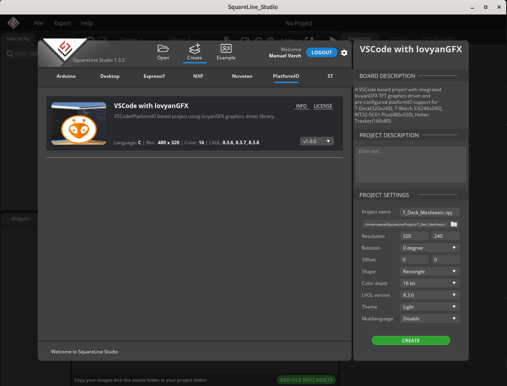

<h1 align="center">SquareLine Studio boards for PlatformIO</h1>

  

 
 

## :ledger: Description

**Overview** 
This repository contains supplemental projects for SquareLine Studio following the Open Board Platform (OBP).

**Installation** 
Copy the contents of the boards folder into the boards folder of SquareLine Studio, e.g.
$HOME/SquareLine/boards/

**Usage** 

1. Launch SquareLine Studio, choose **Create** and select **PlatformIO**
2. Now you see all available PlatformIO based projects (as in the screenshot above, currently only for _lovyanGFX_).
3. Choose _VSCode with lovyanGFX_ when you have devices with TFT screen, such as WT32-SC01 Plus, T-Deck, T-Watch S3, Heltec-Tracker.
4. Enter a name for the new project
5. Create a new directory for this project and select it.
6. Enter the display dimensions of the device. Note: only landscape is currently pre-configured. Leave _rotation_ and _offset_ as they are.
7. Select LVGL version and theme (light/dark)
8. Finally press **CREATE**

**UI Design** 
See https://docs.squareline.io/docs/squareline

**Code Generation** 
When you finished the UI design and want to see how it looks on your device you have to export the UI files. Before you do that you should choose **Export > Create Template Project**. Here you navigate to a directory where you want the VScode project folder to be created.
Whenever you make changes to the UI you can then generate the code into the same folder by selecting **Export > Export UI Files**.

**Compilation** 
After the export finished open the export folder in VScode and wait a few seconds until platformIO has configured the project. Then choose **Switch Project Environment** from the list in the status bar according to your device and hit the build button next to it. Depending on what fonts or widgets you have used in the UI project you may need to enable these in LV_conf.h.

**Upload to Device** 
Connect the device to your computer and hit the **upload** button. To see the debug log messages hit the **Serial Monitor** button in the status bar.
